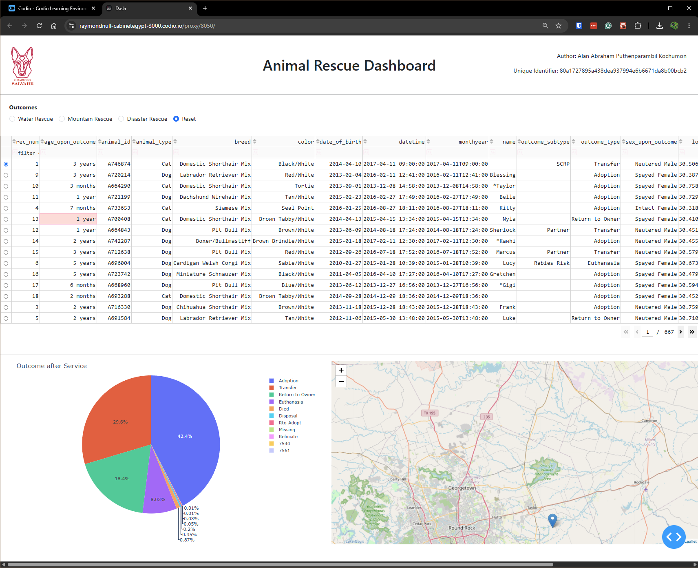
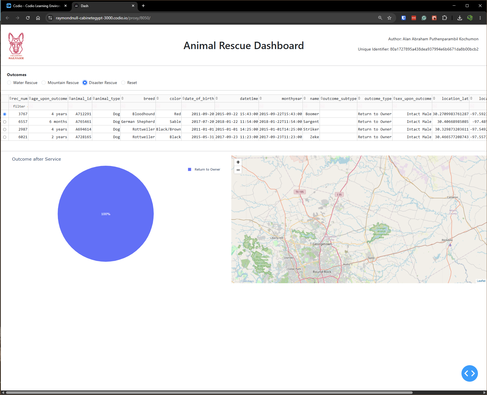
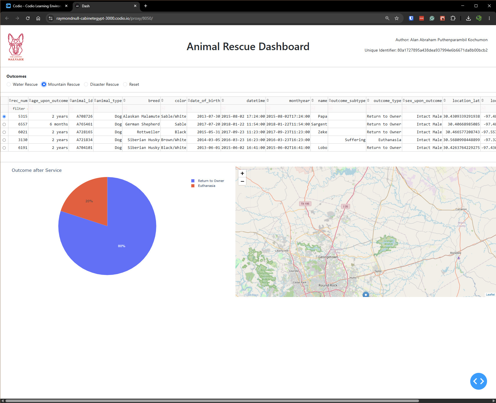
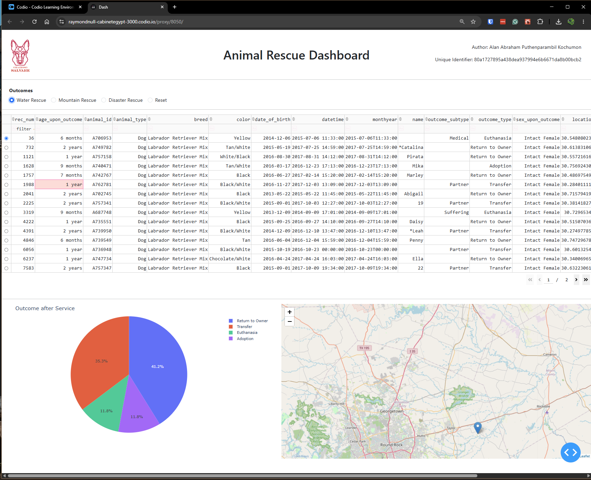

# Animal Shelter

## About the project

The Animal Shelter project is a full-stack dashboard application with a standalone backend Data Access Object (DAO) that communicates with the database via a MongoDB client. It deploys its own middleware following the Model-View-Controller (MVC) paradigm. The application facilitates the viewing of different animals and filtering by specific rescue mission criteria. The project aims to provide a simple, intuitive visual interface to quickly analyze data while allowing for robust data manipulation, such as sorting, pagination, and filtering.

## Motivation

This project acts as an exploratory application to demonstrate secure, object-oriented data management utilizing Python, MongoDB, and Dash. Developed as part of the CS 340 Client/Server Development course, it emphasizes industry-standard practices, including exception handling, clean architectural separation between the database and application logic, and a highly cohesive frontend interface.

## Tools used

- **MongoDB**: All database functionalities are provided by MongoDB. MongoDB serves as the "Model" component of the MVC pattern. Using the PyMongo driver allows for Python-native, dictionary-based queries that closely mirror mongosh syntax. While the interface is encapsulated via the AnimalShelter DAO, querying is made highly efficient. For example, filtering requires simply passing a dictionary populated with our required values (e.g., {"animal_type": "Dog"}), which is far more streamlined than writing raw SQL strings.
- **Dash**: Dash provides the web server and the reactive application framework. It serves as both the "View" (the UI layout) and the "Controller" (the callbacks that process user input). It enabled the creation of an instantaneous, responsive application without requiring JavaScript. Furthermore, this backend-driven approach mitigates frontend data manipulation risks, as the data is securely refreshed from the backend on every request.
- **Dash Bootstrap Components (DBC)**: While raw Dash components can look visually outdated, coupling Dash with Bootstrap via DBC allowed for the creation of a modern, elegant, and highly usable interface with minimal custom CSS.
- **Plotly Express (Pyplot)**: Drawing data graphics typically requires vast amounts of boilerplate code. Plotly Express simplified this process, allowing for the generation of interactive, highly customizable charts with just a few lines of code.
- **Pandas**: While the raw BSON data provided by MongoDB reflects a Python list of dictionaries, it must be decoded into a manipulatable format for the data table and charts. Pandas bridges this gap by converting the raw data into a DataFrame, gracefully handling edge cases and making data manipulation seamless.

## Requirements

- [Python 3](https://www.python.org/downloads/)
- MongoDB: Download the server for testing from https://www.mongodb.com/try/download/community or use Mongo Atlas.
- PyMongo: (`pip install pymongo`) The official MongoDB driver for Python. It enables interaction with any MongoDB database with minimal configuration.
- Jupyter Notebook: (Optional) Recommended for testing the module in an interactive environment.
- Dash: (`pip install dash<3.0.4`). Newer versions can cause problems.
- Dash Bootstrap Components: (pip install dash-bootstrap-components)
- Plotly: (`pip install plotly`)
- Pandas: (`pip install pandas`)

## Getting Started

Follow these steps to reproduce the dashboard:

- **Database Configuration**: Ensure your MongoDB server is running. The application targets a database named `aac` containing an animals collection.
- **Environment Setup**: Ensure Python 3 is installed along with the required dependencies installable by (`pip install -r requirements.txt`)
- **Authentication**: The database requires a secure user account. Use `mongosh` or MongoDB Compass to create a user with `readWrite` privileges restricted to the `aac` database. Update the backend DAO script with these credentials.
- **Launch the Application**: Open the Jupyter notebook file (`ProjectTwoDashboard.ipynb`), and run the file. Please note that it must be in the same directory as `CRUD_Python_Module.py`.
- **Access the Dashboard**: Once the local server starts, open a web browser and navigate to the localhost address provided in the terminal output (typically `http://127.0.0.1:8050/` or ` http://localhost:8050`). The dashboard will instantly render, pulling fresh data securely from the backend.

## Tests

To ensure the resilience and accuracy of the architectural separation between the database and application logic, rigorous manual testing was conducted:

- **Backend Validation**: The MongoDB DAO was tested in an isolated Jupyter Notebook environment. Direct CRUD operations were executed against the aac database to verify that the PyMongo cursor conversions and exception handling behaved gracefully without crashing the application.
- **Frontend Testing**: Manual system testing was performed on the Dash framework. This included verifying that the Plotly Express charts and data tables updated dynamically and synchronously when specific rescue mission filters (e.g., Water Rescue, Mountain Rescue) were toggled via user input. Layout responsiveness was also validated using the Dash Bootstrap Components grid system.

## Screenshots

_Caption: The initial, reset state of the dashboard demonstrating the unfiltered data table and original pie chart._

_Caption: Dashboard successfully executing the Disaster Rescue filter, dynamically updating the data table and charts._

_Caption: Dashboard successfully executing the Mountain or Wilderness Rescue filter._

_Caption: Dashboard successfully executing the Water Rescue filter._

## Steps Taken

The first step in this development lifecycle was to complete the MongoDB driver (the DAO) during Project One. This aimed to bridge the gap between direct MongoDB manipulation and Python using the official PyMongo driver. It encapsulates the inner workings and handles edge cases gracefully, providing a layer of abstraction and decoupling that allows the backend code to be updated without breaking the frontend.

The next step was to architect the frontend dashboard. To overcome the initial learning curve of Dash, I referenced external tutorials to understand component routing. Initially, it was unintuitive that callbacks are invoked indirectly via component IDs rather than direct function calls. I then applied a Bootstrap theme to modernize the UI. Finally, to ensure all client criteria were met, I performed manual testing on all interactive filtering and data rendering options.
Development Challenges & Solutions

During the development of the CRUD module's read method, a primary challenge involved handling return types from the PyMongo driver. Specifically, the `find()` method returns a MongoDB Cursor object rather than a usable Python list. I overcame this by explicitly casting the cursor to a list (list(result)) before returning it to the calling application. Additionally, to ensure application resilience, I implemented try/except blocks around database API calls to gracefully catch connection errors and return standardized fallbacks rather than crashing the downstream application.
Then, during the UI development, an accidental Dash version update broke the application, as the newer environment versions did not support the legacy code structure used in initial testing. I resolved this by rolling back the environment to a stable version compatible with Dash Bootstrap Components.

Moreover, due to the high density of categorical data in the initial dataset, the requested pie chart was rendering too small and becoming unreadable. I solved this UX issue by switching the chart's target metric to "Outcome After Service" (outcome_type), resulting in a much cleaner and more readable visualization for the end user.

## Details

### Writing Maintainable, Readable, and Adaptable Programs

Writing programs that are readable, maintainable, and adaptable is incredibly important, especially when working with larger teams or when software spans hundreds of thousands of lines of code. While this specific project is relatively small, the principles applied here, such as the Single Responsibility Principle from the SOLID framework, where each function does only one thing, are quintessential when writing software in the real world. One of the primary advantages of modularizing the code into the `CRUD_Python_Module.py` is its additive nature and strict adherence to the DRY (Don't Repeat Yourself) principle. I was able to use the exact same module while building the initial application in Project One as well as the dashboard in Project Two. This would not have been possible had the database logic been tightly coupled to the application itself. Furthermore, if similar application needs arise in the future, this CRUD module can be reused. By simply updating configuration variables, such as database credentials and table names, the core data access logic remains completely intact.

### Approaching Problems as a Computer Scientist

As computer scientists, we must utilize various problem-solving skills and analysis tools, such as asymptotic analysis, to ensure that a problem is not just solved, but solved in the best possible way. While finding the perfect algorithm cannot always be guaranteed, this analytical mindset ensures that we avoid worst-case solutions and maintain a working, optimized system. This problem-solving skill is highly transferable to architectural tasks like the Grazioso Salvare dashboard. My approach to this project differed from my usual workflow; typically, for UI-heavy projects, I prefer to design the interface first. However, for this data-heavy application, I started by developing the CRUD module, manually testing the backend, and then building a rudimentary interface before finally polishing it. Due to the nature of the project, the schema was largely predefined by the imported dataset, which translated well to the document-based nature of MongoDB. In the future, whether working with SQL or NoSQL databases, my strategy will involve designing UML diagrams and entity-relationship models, either by hand or using software like Mermaid, to establish a strong architectural head start. Moreover, to ensure type safety and ease of use in future client requests, I will prefer utilizing an Object-Relational Mapper (ORM) over interacting directly with pure database drivers.

### The Role and Impact of Computer Scientists

Computer scientists perform a variety of jobs, ranging from developing new algorithms and solving existing problems to improving legacy solutions. While there are R&D roles where active researchers create novel solutions to non-trivial problems, a massive part of the discipline involves Applied Computer Science: taking existing tools, architecting them securely using principles like MVC, and transforming raw data into actionable insights. A company like Grazioso Salvare can benefit immensely from this applied science. Without a dedicated system, a rescue coordinator might have to spend hours manually cross-referencing spreadsheets to find a search-and-rescue dog that meets highly specific criteria (e.g., age, breed, and intact status for disaster tracking). By engineering an interface that dynamically filters these complex constraints, computer scientists drastically reduce the cognitive load on the end-user. For Grazioso Salvare, this dashboard turns a manual data analysis task into a nearly instantaneous query, ultimately accelerating their operational velocity and improving disaster response times when lives are on the line.

#### Contact

Your name: Alan Abraham Puthenparambil Kochumon
